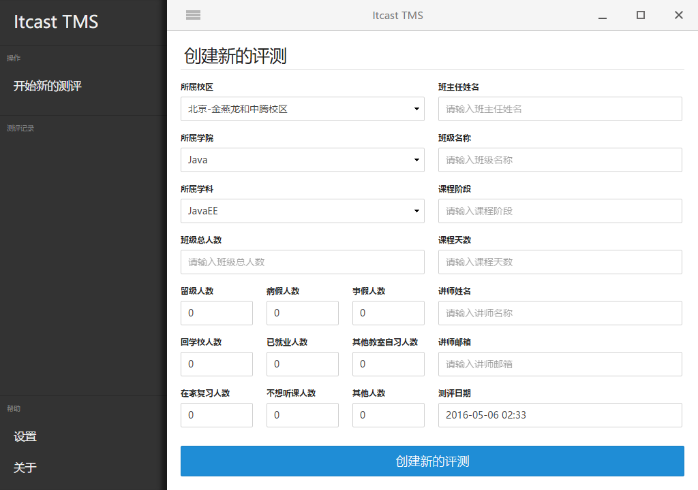
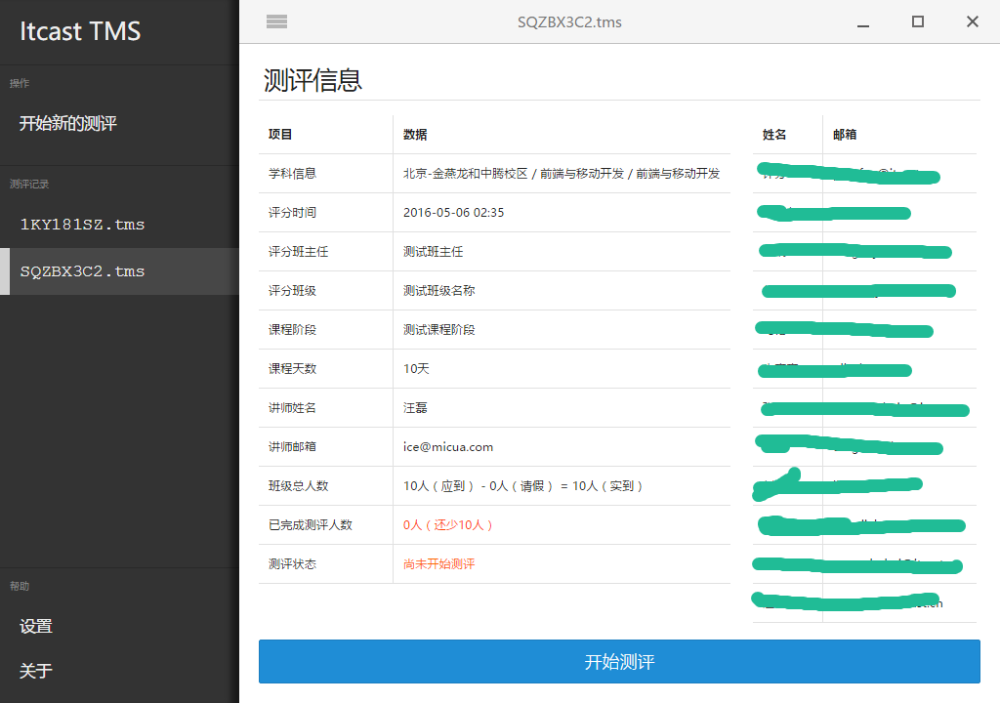

# Itcast Teaching Management System

[](https://travis-ci.org/Micua/itcast-tms)
[](http://standardjs.com/)
[](https://david-dm.org/Micua/itcast-tms)


This repo is a teaching management system for Itcast, Inc. project. You could use it as a base to build your own desktop app.

## Screenshots





## How to use

First, clone the repo via git:

```bash
$ git clone https://github.com/Micua/itcast-tms.git -b v4.x
```

And then install dependencies.

```bash
$ cd itcast-tms
$ npm install
```

### Run it

```bash
$ npm start
```

### Develop it

```bash
$ npm test
```

*Note: requires a node version >= 4 and an npm version >= 2.*


## Native-like UI

If you want to have native-like User Interface (OS X El Capitan and Windows 10), [react-desktop](https://github.com/gabrielbull/react-desktop) may perfect suit for you.


## Maintainers

- [iceStone](https://github.com/Micua)


## LICENSE

ISC © [iceStone](https://github.com/Micua)


## Thanks

- https://github.com/szwacz/electron-boilerplate
- https://github.com/kristoferjoseph/flexboxgrid
- https://philipwalton.github.io/solved-by-flexbox/
- http://www.juxt.com/pov/thoughts/building-native-desktop-apps-with-web-tech
- https://github.com/GitbookIO/nuts
- https://github.com/ArekSredzki/electron-release-server
- https://github.com/maxogden/extract-zip

[](https://github.com/feross/standard)

```bash
npm i angular angular-animate angular-route asar babel-preset-es2015 bluebird clean-css concurrently cross-env del electron-connect electron-packager electron-prebuilt eslint fs-extra gulp gulp-babel gulp-cssnano gulp-htmlmin gulp-if gulp-less gulp-livereload gulp-load-plugins gulp-rename gulp-size gulp-sourcemaps gulp-uglify gulp-useref gulp-zip minimist normalize.css standard --save-dev
cd src
npm i body-parser express log4js nodemailer xtemplate xtpl --save
cd ../updater
npm i download log4js --save
```


## TODOS

- [x] Student submit rate info is empty
- [x] Email keyworks reject
